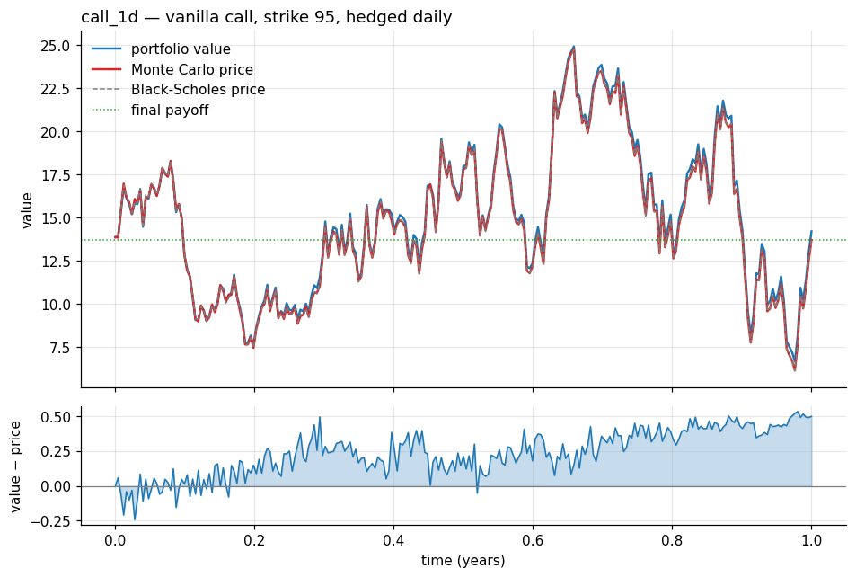
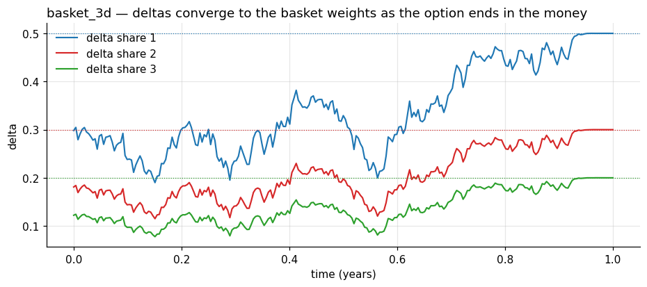
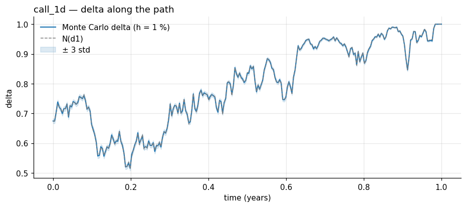
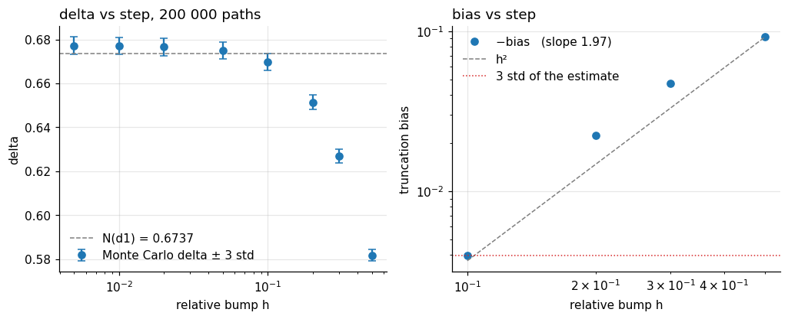
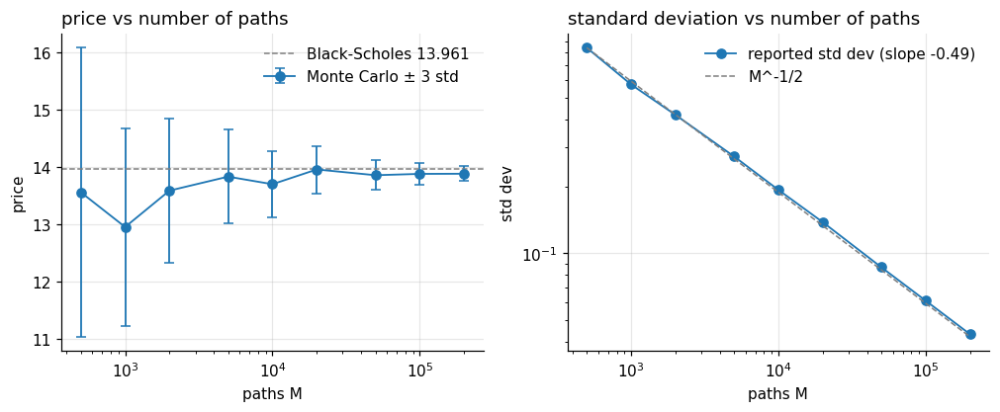

# Monte Carlo Hedging

Monte Carlo pricer and delta-hedging engine for path-dependent options on correlated shares, in C++17.

Price a basket, Asian or performance option under a multidimensional Black-Scholes model, get its
deltas by finite differences on the same paths, then replay a market path day by day: at every
rebalancing date the option is re-priced conditionally on the prices seen so far, and a
self-financing portfolio of the underlyings and cash is rebalanced to the new deltas. The gap
between the portfolio and the option is the measure of the whole chain.



---

## What it does

- **Three payoffs** on 1 to *D* correlated shares: basket call `(Σ wᵈ·Sᵈ_T − K)⁺`, arithmetic Asian
  call `(mean over N+1 fixings of Σ wᵈ·Sᵈ − K)⁺`, and performance `1 + Σᵢ (basketᵢ / basketᵢ₋₁ − 1)⁺`
- **Conditional pricing at any date** — the model takes the fixings already observed plus today's
  spot and only simulates what is left to maturity
- **Deltas on common random numbers** — each simulated path is shifted up and down for every share
  and reused, so a full delta vector costs one set of paths whatever *D* is
- **Self-financing hedge** on a rebalancing grid finer than the option's fixing grid, with the P&L
  against the contractual payoff at maturity
- **Verified** — unit tests on hand-computed payoffs and portfolio recursions, the Black-Scholes
  closed form along an entire hedged path (z-score mean −0.06, std 0.98 over 253 dates), and an
  independent Python replay of the cash recursion that matches the engine to **4 × 10⁻¹³**

## The model

Under the risk-neutral measure each share follows a geometric Brownian motion with volatility σᵈ,
and the Brownian motions have pairwise correlation ρ. With `L` the Cholesky factor of the
correlation matrix and `G` a standard Gaussian vector, one step of length Δt is

```
Sᵈ(t + Δt) = Sᵈ(t) · exp( (r − σᵈ²/2)·Δt + σᵈ·√Δt · (L·G)ᵈ )
```

The pricer draws `M` such paths on the option's `N` fixing dates and returns

```
price   = e^{−r(T−t)} · mean(payoff)                 with its Monte Carlo standard deviation
deltaᵈ  = e^{−r(T−t)} · mean( φ(S·(1+h) on share d) − φ(S·(1−h) on share d) ) / (2·Sᵈ_t·h)
```

At a date `t` between fixings the path handed to the payoff is the observed fixings, then the
simulated ones starting from today's spot; only the simulated rows are bumped, since the observed
ones are facts.

The hedge holds `δᵢ` of each share and puts the rest in cash at the risk-free rate:

```
V₀      = p₀ − δ₀·S₀                                 premium in, shares bought, the rest is cash
Vᵢ      = Vᵢ₋₁ · e^{rT/H} − (δᵢ − δᵢ₋₁)·Sᵢ           cash accrues, the delta change is paid at market
valueᵢ  = Vᵢ + δᵢ·Sᵢ
P&L     = value_H − payoff
```

## Architecture

```
src/
  Option · BasketOption · AsianOption · PerformanceOption   a payoff on a path matrix
  BlackScholes           simulates the path matrix, conditionally on an observed past; shifts one share
  MonteCarlo             price and deltas from an Option and a BlackScholes
  Hedging                the cash recursion, and the two grid helpers (fixing dates ⊂ rebalancing dates)
  Parameters · Portfolio JSON in, JSON out
  price.cpp · hedge.cpp  the two executables, no logic
tests/                   test_options · test_montecarlo · test_hedging
tools/                   simulate_market.py · sweep.py · run_all.sh
scenarios/               params.json + market.txt per scenario
results/                 outputs of every scenario and sweep
notebooks/analysis.ipynb the analysis, regenerates docs/plots/
```

The boundary that matters is the **path matrix**: `(N+1) × D`, one row per fixing date, one column
per share. `BlackScholes` fills it and knows nothing about payoffs; the `Option` classes read it
and know nothing about the model; `MonteCarlo` is the only class that holds both. Adding a payoff
is one class with one method, and adding a model would not touch a single option.

Linear algebra and random numbers come from the [PNL](https://github.com/pnlnum/pnl) library
(`PnlMat`, `PnlVect`, Mersenne Twister, Cholesky).

## Results

Five scenarios in `scenarios/`, each with a market path simulated by `tools/simulate_market.py`
under a real-world drift different from the risk-free rate. Outputs are in `results/`, the analysis
is in `notebooks/analysis.ipynb`. Every hedge re-prices with 50 000 paths at each rebalancing date.

| scenario | payoff | D | K | fixings | rebalancings | T | price₀ | payoff | final value | P&L | P&L / price₀ | time |
|---|---|---|---|---|---|---|---|---|---|---|---|---|
| call_1d | basket | 1 | 95 | 1 | 252 | 1 y | 13.860 ± 0.086 | 13.701 | 14.200 | +0.499 | +3.6 % | 1.5 s |
| basket_3d | basket | 3 | 100 | 1 | 252 | 1 y | 8.296 ± 0.054 | 16.895 | 16.483 | −0.413 | −5.0 % | 3.5 s |
| asian_2d | asian | 2 | 100 | 12 | 252 | 1 y | 4.371 ± 0.029 | 0.000 | 0.260 | +0.260 | +5.9 % | 11.1 s |
| perf_4d | performance | 4 | — | 12 | 120 | 2 y | 1.245 ± 0.001 | 1.155 | 1.147 | −0.007 | −0.6 % | 11.9 s |
| basket_10d | basket | 10 | 100 | 1 | 250 | 1 y | 7.795 ± 0.050 | 5.590 | 5.369 | −0.221 | −2.8 % | 12.6 s |

### The P&L has a sign, and the sign is explained

A daily hedger is exposed to the difference between the variance the model charged for and the
variance the path delivered, weighted by gamma. `call_1d` realized 23.1 % against the 25 % it was
priced at: the gamma-weighted mismatch predicts **+0.58** and the hedge made **+0.50**. `basket_3d`
realized 18.0 % on the basket against the model's 17.3 %, spent 151 days within 5 points of the
strike, and lost 0.41. In all four scenarios with a live delta, the P&L has the sign of
`σ²_model − σ²_realized`.

### The deltas converge to the basket weights



Once the basket is certain to finish above the strike the payoff is `Σ wᵈ·Sᵈ − K`, and the
finite-difference deltas land on `[0.5, 0.3, 0.2]` exactly — the hedge ends up holding the basket
itself, without that being coded anywhere.

### Black-Scholes along the whole path



On the one payoff with a closed form, the Monte Carlo price and delta are compared to Black-Scholes
at every one of the 253 rebalancing dates: the price z-scores have mean −0.06 and std 0.98 with
none beyond 3, and the delta is within 0.0016 of N(d1) on average.

### The finite-difference step



With common random numbers the noise on the delta does not grow as `h` shrinks, while the
truncation bias grows like `h²`: −0.004 at a 10 % bump, −0.09 at 50 %. The scenarios use 1 %.

### Convergence



The reported standard deviation falls with a log-log slope of −0.49 from 500 to 200 000 paths, and
the closed form stays inside three standard deviations at every size.

## Verification

| Check | Result |
|---|---|
| Payoffs on hand-built paths (call, basket, Asian, performance; scale invariance of the performance) | unit-tested, exact |
| Monte Carlo call price vs `pnl_bs_call` | within 3 std at 50 000 paths |
| Finite-difference delta vs N(d1) at `h = 10 %` and `h = 1 %` | bias 0.009 → 0.003, both within tolerance |
| Standard deviation ratio between 500 and 50 000 paths | 10.5 (expected 10) |
| Cash recursion on two hand-computed cases, P&L, grid helpers | unit-tested, exact |
| Engine `value` column vs an independent numpy replay of the recursion from the engine's own deltas | max gap **4.4 × 10⁻¹³** over 5 scenarios |
| Monte Carlo price vs Black-Scholes at all 253 dates of a hedged path | z-score mean −0.06, std 0.98, 0 beyond 3 |
| Realized hedging P&L vs the gamma-weighted variance mismatch | +0.50 vs +0.58 |
| Performance-option deltas on day 0 (payoff homogeneous of degree 0, exchangeable shares) | 10⁻⁶ ± 1.6·10⁻⁶ |
| Memory | valgrind: 0 errors, 0 leaks on both executables |

## Running it

Requires CMake ≥ 3.5, a C++17 compiler, [PNL](https://github.com/pnlnum/pnl) and
[nlohmann/json](https://github.com/nlohmann/json) (fetched automatically if not installed).

```bash
cmake -S . -B build -DCMAKE_BUILD_TYPE=Release -DCMAKE_PREFIX_PATH=/path/to/pnl
cmake --build build
ctest --test-dir build --output-on-failure

build/price scenarios/call_1d/params.json
build/hedge scenarios/call_1d/params.json scenarios/call_1d/market.txt
```

All scenarios and the two sweeps, then the notebook:

```bash
tools/run_all.sh
python3 tools/sweep.py
jupyter nbconvert --to notebook --execute --inplace notebooks/analysis.ipynb
```

`price` prints the price, its standard deviation, the deltas and theirs. `hedge` prints one
position per rebalancing date (price, deltas, portfolio value, all with standard deviations) and
the final payoff and P&L.

### Scenario files

`params.json` describes the option, the model, the Monte Carlo and the hedging grid. Vectors of
length 1 are broadcast to all shares.

```json
{
  "option":     { "type": "basket", "strike": 100.0, "maturity": 1.0, "fixingDates": 1, "weights": [0.5, 0.3, 0.2] },
  "model":      { "size": 3, "spot": [100.0], "volatility": [0.20, 0.25, 0.30], "correlation": 0.3, "rate": 0.03 },
  "monteCarlo": { "samples": 50000, "fdStep": 0.01 },
  "hedging":    { "rebalancingDates": 252 },
  "market":     { "drift": [0.05, 0.02, 0.08], "seed": 23 }
}
```

`market.txt` is an `(H+1) × D` matrix of prices, one rebalancing date per row. The number of
rebalancings must be a multiple of the number of fixings. The `market` block is only read by
`tools/simulate_market.py`, which writes the path under the real-world drift; the pricer never sees
it.

## What this does not model

- **Transaction costs** — every rebalancing is free
- **Stochastic rates or volatility** — constant in the model; the P&L section is what their
  mismatch with the market costs
- **Variance reduction** — plain Monte Carlo; the standard deviation at 50 000 paths is the price of
  that simplicity

---

*Research and educational use. All figures are computed from the scenario files in this repository
under the assumptions stated above.*
